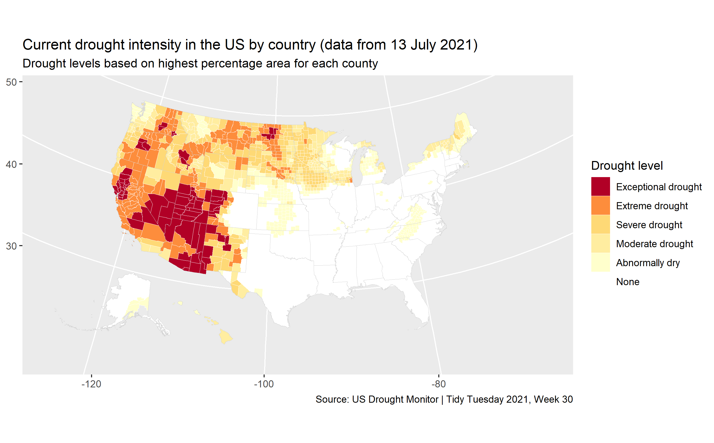

# tidytuesday

2022-week04

[data]() | [code](https://github.com/lynleyaldridge/tidytuesday/blob/main/2022/2022-week04/top10twoplayergames.R)

2021-week30

[data](https://github.com/rfordatascience/tidytuesday/tree/master/data/2021/2021-07-20) | [code: geofaceted bar plots](https://github.com/lynleyaldridge/tidytuesday/blob/main/2021/2021-week30/drought_state.R)

[code: US county map using urbnmapr](https://github.com/lynleyaldridge/tidytuesday/blob/main/2021/2021-week30/drought_county_map.R)

2021-week29

[data](https://github.com/rfordatascience/tidytuesday/tree/master/data/2021/2021-07-13) | [code: faceted bar plots, ordered by rank within facets](https://github.com/lynleyaldridge/tidytuesday/blob/main/2021/2021-week29/motive_decade.R)

2021-week09

[data](https://github.com/rfordatascience/tidytuesday/tree/master/data/2021/2021-02-23) | [code: Cleveland box chart](https://github.com/lynleyaldridge/tidytuesday/blob/main/2021/2021-week09/employment-occupation-race.R)

2020-week40

[data](https://github.com/rfordatascience/tidytuesday/tree/master/data/2020/2020-09-29)

[code: gt summary table with images and inline bar chart](https://github.com/lynleyaldridge/tidytuesday/blob/main/2020/2020-week40/swift-albums.R)

[code: gt summary table with summary rows](https://github.com/lynleyaldridge/tidytuesday/blob/main/2020/2020-week40/compare-sales.R)

[code: bar chart with country flags using ggflags](https://github.com/lynleyaldridge/tidytuesday/blob/main/2020/2020-week40/by-country.R)

