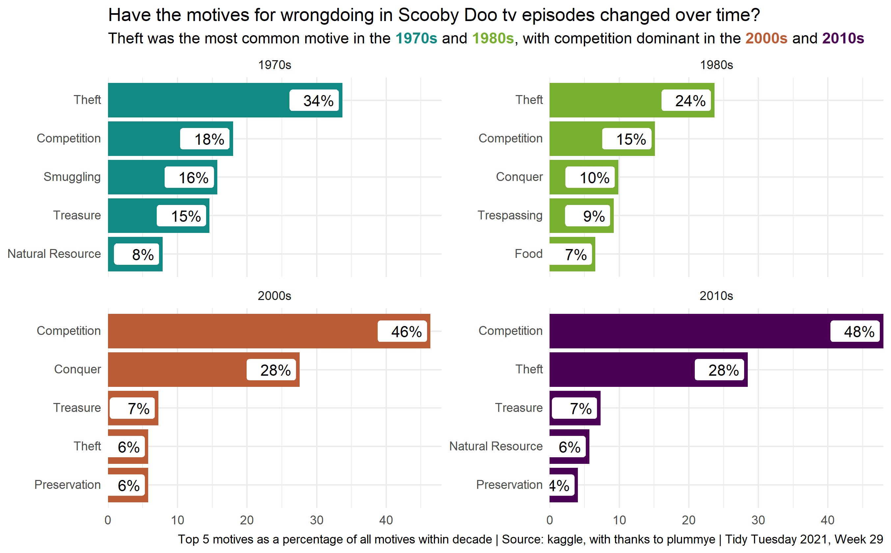
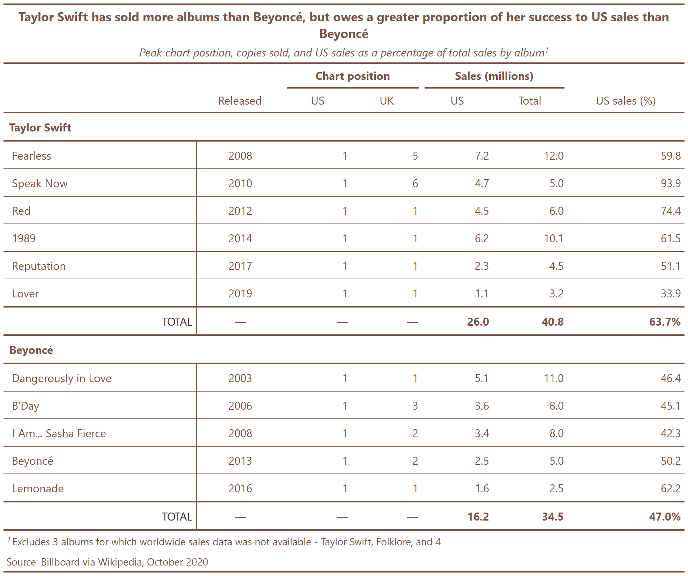

# tidytuesday

[2021-week29](https://github.com/rfordatascience/tidytuesday/tree/master/data/2021/2021-07-13)

[2021-week09](https://github.com/rfordatascience/tidytuesday/tree/master/data/2021/2021-02-23)

[2020-week40](https://github.com/rfordatascience/tidytuesday/tree/master/data/2020/2020-09-29)

